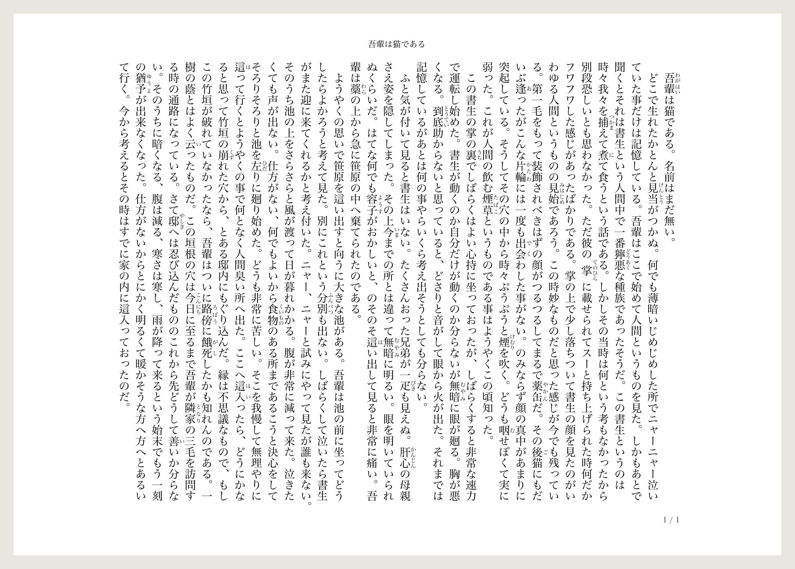
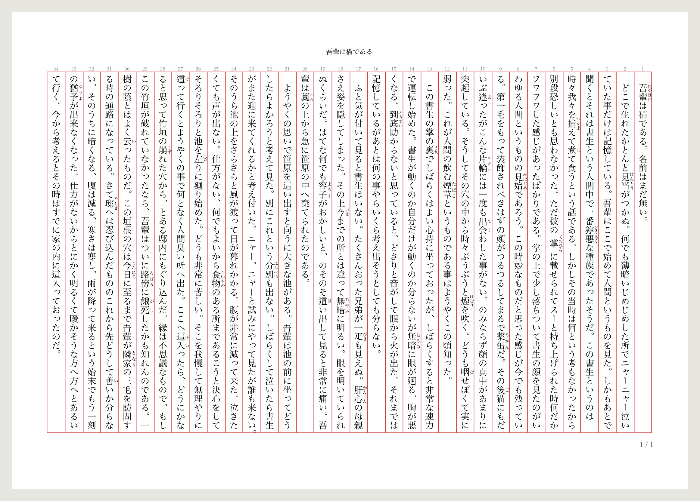

# Japanese Novel

[日本語](./README.md) | English

Write, proofread, and typeset Japanese novels in Visual Studio Code — vertical
layout, [Aozora Bunko](https://www.aozora.gr.jp/annotation/index.html) markup,
one-command HTML / EPUB / text builds, printing straight from your browser.
No AI anywhere in the writing path (see [No-AI policy](#no-ai-policy)).



*A printed page of the built output, unretouched: the opening of Natsume Sōseki's* I Am a Cat *(Aozora Bunko).*

## Features

- **Vertical preview** — live, cursor-following 縦書き rendering beside the editor,
  using the same layout engine as the builds.
- **Aozora Bunko annotations** — ruby (including both-side), emphasis dots, side
  lines, bold/italic, tate-chū-yoko, indents, page breaks.
- **Auto indent** — every Enter starts the new line with a full-width space;
  open it with `「` or `『` and the space is removed.
- **Book builds** — collect chapters into a paginated vertical HTML file which can
  be **Print / Save as PDF**, EPUB, or a concatenated Aozora-format text.
- **Proofreading** — hygiene checks on by default, opt-in manuscript-convention
  lints, quick fixes and a fix-all action.
- **Cast & keyword highlighting** — semantic colouring of character names and
  coined terms in narration.


*The everyday writing layout: the book's table of contents, the manuscript, and the vertical preview in one window.*

## Design stance

- **No AI.** Nothing in the writing path involves AI; Copilot is disabled by
  default for `.jpnov` / `.jpbook` (see [No-AI policy](#no-ai-policy)).
- **Dictionary-free.** No morphological analysis, no bundled word lists —
  ordinary words are never flagged, and every coined term you declare is
  recognised. What deserves highlighting is the author's call; the lint rules
  reason about structure.
- **Zero runtime dependencies.** Everything ships bundled: no package manager,
  no post-install downloads, no network traffic — fully offline, with an
  instant preview. Printing opens a local file in your own browser.
- **Non-invasive.** Sources are plain text in Aozora notation under dedicated
  extensions (`.jpnov` / `.jpbook`), so no `.txt` / `.md` project is ever
  touched, and the manuscript outlives the tool.

## Quick start

1. **Make a book.** Open the **Books** view in the Activity Bar (the
   **Japanese Novel** book icon) and click **Create a Book…** (`+`): the
   input box already holds `.jpbook`, so type only the name before it. The
   new book opens right there with its **Book Info**, **Cover pages** and
   **Chapters** sections. One `.jpbook` is one book: a plain text file with
   one chapter path per line, each relative to the workspace folder, so
   moving the `.jpbook` never breaks them. An optional `---`-fenced block at
   the top carries the book's own metadata — title, running head,
   page-number style (see
   [Per-book metadata](#per-book-metadata-front-matter)). Editing the file
   by hand does the same thing the view does.
2. **Write chapters.** Click **New chapter…** under **Chapters** and name
   the chapter the same way: the `.jpnov` file is created, listed in the
   book, and opened in the editor. Aozora Bunko annotations are highlighted as you type;
   click the preview icon in the editor title bar (**Japanese Novel: Open
   Preview to the Side**) to write beside the vertical layout.
3. **Build it.** Save everything (builds read from disk) and click **Print /
   Save as PDF** at the bottom of the view: the book opens in your browser,
   and the same button floating on the page (印刷／PDF 保存) brings up
   the print dialog — print on paper, or choose Save as PDF there for a PDF.
   The text and EPUB buttons sit beside it. With a book open, the buttons
   build just that book; back in the list, they build every checked book.

Chapters and book files can live anywhere in the workspace folder; subfolders are
mirrored into the output (`src/volume1.jpbook` builds to
`dist/src/volume1.html`). The output folder (`jpnov.layout.outDir`, default
`dist`), dot-folders, and `node_modules` are never scanned. The extension
activates when you open a `.jpnov`/`.jpbook`, when a workspace folder
contains a `*.jpbook`, or when any `jpnov.*` setting is saved at workspace
or folder level — preview and book editing need no configuration at all. A
**Get started with Japanese Novel** walkthrough covers the same steps.

## A 60-second Japanese typography primer

The terms this document (and the settings UI) uses, for readers who know code
but not Japanese typesetting:

- **Vertical writing (縦書き)** — text runs top-to-bottom, lines advance
  right-to-left, books open "backwards". The preview and the built pages are
  all vertical; the source you edit stays ordinary horizontal text.
- **Ruby (ルビ)** — small reading glosses beside the base characters (furigana).
  In vertical text they sit to the right; a second gloss can sit on the left
  (両側ルビ, "both-side ruby") — often a translation or nuance note.
- **Emphasis dots (傍点)** — the Japanese counterpart of italics: a small mark
  beside every emphasised character. Nine dot shapes plus five side-line styles
  (傍線) are part of the Aozora vocabulary, and all are supported.
- **Tate-chū-yoko (縦中横)** — a short horizontal run ("42", "!?") stood upright
  in a single character cell within vertical text. Half-width pairs `!!` `!?`
  `?!` `??` are combined automatically by default
  (`jpnov.layout.autoTcy`); anything else takes an explicit annotation.
- **Kinsoku (禁則処理)** — Japanese line-breaking prohibitions, applied at every
  wrap in preview and builds alike (`jpnov.layout.kinsoku`, default `strict`):
  opening brackets never end a line; closing punctuation, middle dots, repetition
  marks, small kana and `ー` never start one; `――` and `……` runs never split; and a
  trailing `、`/`。` hangs into the margin (ぶら下げ) instead of pushing text down.
  `relaxed` lets small kana and `ー` start a line and may break a long symbol run
  between pairs (Word's standard level); `none` is a bare wrap at the column width.

  | kinsoku `none` | kinsoku `strict` (default) |
  | :---: | :---: |
  |  |  |

- **Dashes (ダッシュ)** — Japanese novels write a dash as a doubled pair
  (`――`), and it is typeset as one unbroken dash. Pick the
  character you write in `jpnov.lint.common.dash` (default `―`); any other
  dash character, or a run of an odd number of dashes, is flagged with an
  auto-fix. In HTML and EPUB output, the chosen character is typeset as
  the em dash (`—`), and Japanese fonts join the pair into one unbroken line.

- **Genkō-yōshi (原稿用紙)** — the manuscript grid Japanese prose is drafted
  on. The default page is **40 characters × 34 lines**, and the line pitch
  comes in four steps
  (`jpnov.layout.linePitch`); turn on line numbers and column
  rules for the classic manuscript-paper look, shown here at the 2× pitch:

  

- **Aozora Bunko notation** — the de-facto plain-text markup for all of the
  above, used by Japan's public-domain digital library. Sources stay portable:
  a `.jpnov` file is meaningful with or without this extension.

## Annotations

Novel sources use [Aozora Bunko annotations](https://www.aozora.gr.jp/annotation/index.html).
Recognised forms are highlighted and rendered; anything else passes through as
an HTML comment (never an error), so unusual markup degrades quietly.

Most annotations take a **forward-ref** form: the annotation follows the text it applies to and names it. Where the range is easier to bracket, a **start / end** pair wraps it inline; for multi-line ranges a **block** form puts the start and end annotations on their own lines. All spellings render the same.

| Effect | Forward-ref form | Start / end form | Block form |
| --- | --- | --- | --- |
| Ruby | `漢字《かんじ》` | `｜親文字《ルビ》` | — |
| Left ruby 左ルビ | `［＃「対象」の左に「よみ」のルビ］` | — | — |
| Tate-chū-yoko 縦中横 | `対象［＃「対象」は縦中横］` | `［＃縦中横］…［＃縦中横終わり］` | — |
| Emphasis dots 傍点 | `［＃「対象」に傍点］` | `［＃傍点］…［＃傍点終わり］` | — |
| Side line 傍線 (5 styles) | `［＃「対象」に傍線］` (傍線/二重傍線/鎖線/破線/波線) | `［＃傍線］…［＃傍線終わり］` | — |
| Bold 太字 | `［＃「対象」は太字］` | `［＃太字］…［＃太字終わり］` | `［＃ここから太字］…［＃ここで太字終わり］` |
| Italic 斜体 | `［＃「対象」は斜体］` | `［＃斜体］…［＃斜体終わり］` | `［＃ここから斜体］…［＃ここで斜体終わり］` |
| Heading 見出し | `第一章［＃「第一章」は大見出し］` (大見出し / 中見出し / 小見出し) | `［＃大見出し］…［＃大見出し終わり］` | `［＃ここから大見出し］…［＃ここで大見出し終わり］` |
| Indent 字下げ | `［＃○字下げ］` (line head) | — | `［＃ここから○字下げ］…［＃ここで字下げ終わり］` |
| Page break | `［＃改ページ］` (on its own line) | — | — |


The specimen is typeset at 2× line pitch for the left ruby. Its source —
paste it into a `.jpnov` to try:

```text
　物語《ものがたり》が始まる。
　｜お茶の間《おちゃのま》へ届け。
　覚悟［＃「覚悟」に傍点］を決めた。
　運命［＃「運命」に波線］が動く。
　英雄《えいゆう》［＃「英雄」の左に「ヒーロー」のルビ］の登場。
　第42［＃「42」は縦中横］話、太字［＃「太字」は太字］で。
「何だと!?」
```

Notes: 傍点/傍線 take a left-side variant spelled differently in each form — the
**forward-ref** form uses `の左に` (`［＃「対象」の左に傍点］`), the **start / end**
form uses bare `左に` (`［＃左に傍点］…［＃左に傍点終わり］`); bold/italic use the
connector **は**. Indent counts (`○`) are **full-width digits** (２, １０); the block indent
also indents wrapped continuation lines. An unclosed block (`ここから` with no
`ここで…終わり`) still renders to the end of the file but raises an editor
**Warning**; an unclosed `［＃` is an **Error**. Italic relies on the browser
synthesising an oblique for Japanese fonts.

**Left ruby** puts a reading on the left of the preceding text; pair it with an
ordinary right ruby for 両側ルビ (`青空文庫《あおぞらぶんこ》［＃「青空文庫」の左に
「aozora bunko」のルビ］` — the annotation names the base only, never the `《》`
part). Left readings are exempt from the ruby-kana lint, since they are often
Latin. Left ruby needs room to the left of the line — set
`jpnov.layout.linePitch` to `2` or wider. At tighter pitches the reading
overlaps the neighbouring line. **縦中横** stands a short run upright in one
square — keep it to 3 characters or fewer (a longer run is squeezed to fit
and raises a Warning). **自動縦中横**
(`jpnov.layout.autoTcy`, default `punctuationPairs`) auto-combines the
half-width pairs `!!` `!?` `?!` `??` with no markup — runs of three or more are
never touched — and the text build writes the explicit markers out, so the
`.txt` round-trips; set it to `none` to turn it off.

## Auto indent

Japanese novels open each paragraph with one full-width space and leave
dialogue lines starting with `「` or `『` unindented. The editor follows that
convention as you type:

- Pressing Enter starts the new line with a full-width space.
- Open the line with `「` or `『` and the space is removed.
- Press Enter again without typing anything and the leftover space is
  cleared, leaving a true blank line.
- Only spaces inserted automatically are ever removed.

Turn it off under **Japanese Novel — Editor** (`jpnov.editor.autoIndent`).

## Preview

Open it from the editor title bar (**Open Preview to the Side**) on any
`.jpnov`. The preview is a continuous vertical flow re-rendered as you type;
it follows the editor cursor, wraps and breaks lines with the exact engine the
builds use, and shows `［＃改ページ］` as a labelled dashed marker. Line numbers
(on by default, restarting at every page break) and manuscript-paper column rules
are toggled under **Japanese Novel — Layout & Output**.

## Building books

The **Books** view in the Activity Bar lists every discovered `.jpbook` as
a book with a checkbox (labelled by its front-matter `title` when it declares
one). The buttons at the bottom of the view build the checked books (EPUB
is an icon button):

- **Print / Save as PDF** — builds the HTML and opens it in your default
  browser. The same button floating on the page (印刷／PDF 保存)
  brings up the browser's print dialog; print on paper, or save it as a PDF
  instead. Use Chrome (recommended) or Firefox. Safari is not recommended:
  it ignores the paper size and orientation the HTML declares (`@page size`),
  so you would have to pick them in its print dialog (landscape by default)
  and leave its headers and footers off. The `.html` itself lands in the output
  folder: one standalone, paginated vertical file per book (inline CSS, no
  external assets) that prints the same way whenever you reopen it.
- **Build to Text** — the chapters concatenated as Aozora-format `.txt`
  (auto-tate-chū-yoko is materialised as explicit annotations, so the text
  round-trips).
- **Build to EPUB** — a reflowable EPUB 3 per book: vertical writing and
  right-to-left page turning carry over into the reader, while font size and
  line wrapping follow the reading device. One spine file per chapter, split again
  at ［＃改ページ］.

Outputs land in `<outDir>/<book path>.{html,epub,txt}` with `outDir`
defaulting to `dist`. Two book files that resolve to the same output path fail
the build with a diagnostic.

A PDF saved from the print dialog embeds a subset of each font it uses. With
the default stack, the result is fine to submit to a print shop and to sell:
Hiragino Mincho (macOS) and Yu Mincho (Windows) are OS-bundled fonts whose
licences permit commercial use of rendered output and PDF embedding, and Noto
Serif JP is openly licensed (SIL OFL). When `jpnov.layout.fontFamily` names a
commercial font, check that its licence allows PDF embedding.

A `.jpbook` is a reading-order table of contents — file names and folder
layout never decide what a book contains or in what order. That scales to long
works. Keep one `.jpbook` per volume and send your editor only the newest
volume. Keep alternate drafts of a chapter side by side and swap a
single line to retarget a submission. Name and move chapter files freely; the
book keeps its order.

The built output has no table-of-contents page yet. Headings come from
annotations (see [Annotations](#annotations)), and chapters appear in the
order the `.jpbook` lists them.

On `.jpbook` files the editor offers completion (chapter paths, metadata keys,
and enum values), diagnostics (missing files, duplicates, escaping the
workspace, unknown metadata keys…), and document links — Cmd/Ctrl-click an
entry to open the chapter.

The Books view edits books, too. Open one to see its **Book Info**,
**Cover pages** and **Chapters** sections: **New chapter…** creates a chapter
file and adds it to the book, **Add chapters…** brings in files you already
have, dragging (or the arrow buttons) reorders them, and **×** takes an entry
out of the book while keeping the file. **Cover pages** manages the `cover`
list the same way (see [Submission cover sheets and title
pages](#submission-cover-sheets-and-title-pages)). Expand **Book Info** and
click a row to edit that value in place; the buttons at the bottom build only
the open book.
Every action rewrites the `.jpbook` text itself, so the view and
hand-editing always agree.


Renaming or moving a chapter (or a folder of chapters) inside VS Code offers
to update every `.jpbook` that references it —
`jpnov.editor.updateRefsOnFileMove` picks `prompt` (default), `always`, or
`never` — the same three choices VS Code offers for updating imports on file
move. Renames made outside VS Code
can't be tracked; the missing path is flagged in the editor instead.

### Per-book metadata (front matter)

Page furniture belongs to the book: two volumes in one workspace can carry
different running heads, and the chapter divider is part of a book's identity
too. A `.jpbook` therefore starts with an
optional `---`-fenced block of `key: value` lines:

```text
---
title: 作品名　第一巻
header: 作品名　一
pageNumber: right
pageNumberFormat: {page} / {totalPage}
divider: ＊　＊　＊
---
01_prologue.jpnov
02_chapter1.jpnov
```

| Key | Default | Meaning |
| --- | --- | --- |
| `title` | — | Display name in the Books view and the EPUB title (the output path still derives from the file name) |
| `author` | — | Author name; becomes the EPUB creator metadata |
| `header` | `""` | Running head centred at the top of every page; omit for none |
| `pageNumber` | `right` | Page-number placement: pinned (`right`, `left`) or alternating per page (`rightLeft`, `leftRight`), or `none` |
| `pageNumberFormat` | `{page} / {totalPage}` | Page-number text; blank suppresses it |
| `divider` | — | Chapter divider inserted between chapters that do not open with a heading (e.g. `＊　＊　＊`); a bare mark is centred along the line at build time, a `［＃３字下げ］` prefix indents it instead; omit for a single blank line |
| `cover` | — | Cover pages placed before the body: a cover sheet, a title page, a synopsis (see below) |

Every key is optional; unknown keys warn and are ignored, so future keys stay
forward-compatible. The six keys from `title` to `divider` are also editable from
the **Book Info** rows in the Books view, and `cover` from its **Cover pages**
section.

### Submission cover sheets and title pages

Competition guidelines routinely ask for pages ahead of the manuscript — a cover
sheet, a title page, a synopsis. The files listed under `cover` become those
pages, in order:

```text
---
title: 作品名
author: ペンネーム
cover:
  - cover.jpnov
  - synopsis.jpnov
---
chapter1.jpnov
```

Paths work exactly like chapter paths. Each file starts a new page. The pages ship in
the HTML build, and so in any PDF saved from it. The running head and page numbering
start on the first body page, however many cover sheets precede it.

The Books view's **Cover pages** section adds, creates and reorders these files
just like chapters; **New cover page…** seeds the new file with the sample below.

A cover file can pull in the book's own metadata:

| Book value | Annotation |
| --- | --- |
| Title | `［＃ここに「タイトル」の値を表示］` |
| Author | `［＃ここに「ペンネーム」の値を表示］` |
| Total pages | `［＃ここに「総ページ数」の値を表示］` |
| Manuscript sheets (the body reflowed onto 400-character 原稿用紙, 20 × 20) | `［＃ここに「原稿用紙換算枚数」の値を表示］` |

```text
［＃５字下げ］［＃ここに「タイトル」の値を表示］
［＃７字下げ］［＃ここに「ペンネーム」の値を表示］
［＃７字下げ］全［＃縦中横］［＃ここに「総ページ数」の値を表示］［＃縦中横終わり］ページ
［＃７字下げ］４００字詰め原稿用紙換算［＃縦中横］［＃ここに「原稿用紙換算枚数」の値を表示］［＃縦中横終わり］枚
```

A build fills in that book's values. The preview shows stand-ins — タイトル, ペンネーム, and
NaN — so one cover file serves any number of books. To decorate a substituted value,
wrap it in the start/end form
(`［＃大見出し］［＃ここに「タイトル」の値を表示］［＃大見出し終わり］`).

The manuscript-sheet count is the number of vertical 20 × 20 manuscript sheets
(400字詰め原稿用紙) the body fills, the unit Japanese literary contests state length in.
Annotations and kinsoku are handled as in the build; a centred chapter divider is counted as
if placed at the line head.

## Character & keyword highlighting

Declare your **cast** and a few **coined keywords** in settings (**Japanese
Novel — Editor**, per workspace folder), so they stand out while you
write — handy where Japanese drops the subject:

```json
// .vscode/settings.json
{
  "jpnov.editor.highlight.characters": ["山田　太郎", "John Smith"],
  "jpnov.editor.highlight.keywords": ["王都"]
}
```

- **`jpnov.editor.highlight.characters`** — each name is split on the half-/full-width
  space into surname + given, so the full name, the surname alone, and the
  given name alone are all recognised. A character is highlighted only where it
  reads as a **subject**: a name (optionally with one honorific such as `さん` /
  `先生` / `ちゃん`) immediately followed by `は` or `が` — e.g. `太郎は`,
  `山田さんが`. Common pronouns (`僕` / `私` / `俺` / `彼` / `彼女` …) are
  recognised the same way. Dialogue inside `「」` / `『』` is left in the body
  colour; only narration is scanned.
- **`jpnov.editor.highlight.keywords`** — coined terms (a fantasy noun, a place, …)
  are **bolded** wherever they appear in narration, without changing colour.
  If a surface is in both lists, the subject form wins.

Matching is exact — no dictionary, no guessing — so ordinary words are never
miscoloured and invented names are always caught. Both lists apply per
workspace folder and take effect immediately in open
editors — no reload, no rebuild. Colouring is delivered as LSP semantic tokens;
override the colours under `editor.semanticTokenColorCustomizations` if you
like.


## Proofreading (lint)

Japanese Novel runs prose checks as you write, surfaced as editor diagnostics
with quick fixes (and a **Fix all auto-fixable problems** source action).
Everything is a plain `jpnov.lint.*` setting under **Japanese Novel — Lint**.

Every check knows what it is looking at: narration, dialogue (`「…」`), a
heading line, a ruby reading, an annotation. A narration rule never fires
inside a line of dialogue, a heading hangs free of the sentence-ending rule,
and a kanji run split by an annotation (`聴覚視覚［＃太字］区分装置`) still
counts as one run — the checks see the text the way a reader will.

- **Hygiene checks are on by default** — half-width kana, decomposed (NFD)
  characters, zero-width spaces, invalid control characters, and trailing
  spaces (`common.noTrailingSpace`) — so a stray malformed or invisible
  character never slips into a manuscript. The dash check (`common.dash`) is
  on too, keeping one dash character throughout.
- **Manuscript-convention checks are on by default too**, each with its own
  switch and message: paragraph indent (`narration.indent`), narration lines
  ending with `。` (`narration.endPeriod` — a trailing `……` or dash still
  wants its `。`), no punctuation right before a closing bracket
  (`dialogue.closingPunct`), no leading space on a dialogue line
  (`dialogue.noIndent`), a space after `！`/`？` (`common.exclamationSpace`),
  even-count ellipses (`common.ellipsis`), and bracket pairing
  (`noUnmatchedPair`). All but the bracket matcher auto-fixable; a
  symbol-only scene-break line (`＊`) is exempt from the paragraph rules.
- **Stricter checks are opt-in.** Length/run limits (`sentenceLength`,
  `maxTen`, `maxKanjiRun`, `arabicDigits`), blank lines in a row
  (`blankRun`, auto-fixable), the `！？`-pair style, and the ruby-kana rule.

Syntax problems (an unclosed `［＃` annotation, a dangling block end) are
always reported, independent of lint settings.


## Settings reference

Most settings are window-level; the output folder and the
highlighting lists are per workspace folder.

### Japanese Novel — Layout & Output

| Setting | Default | Meaning |
| --- | --- | --- |
| `jpnov.layout.charsPerLine` | `40` | Characters per line (16–64), preview and builds |
| `jpnov.layout.linesPerPage` | `34` | Lines per page in builds (16–64) |
| `jpnov.layout.linePitch` | `1.5` | Line pitch as a multiple of the character size: `1.5` / `1.75` / `2` / `2.25`; preview and built pages |
| `jpnov.layout.fontFamily` | `""` | Body font as a CSS font-family list: blank uses the default Mincho stack; preview and built HTML |
| `jpnov.layout.kinsoku` | `strict` | Line-breaking rules: `none` / `relaxed` / `strict` |
| `jpnov.layout.autoTcy` | `punctuationPairs` | Auto-combine `!!` `!?` `?!` `??`; `none` to disable |
| `jpnov.layout.preview.lineNumbers` | `true` | Line numbers in the preview, restarting per page break |
| `jpnov.layout.preview.edgeLine` | `none` | Column rules in the preview: `none` / `text` / `red` |
| `jpnov.layout.paper.size` | `a4` | Paper size the built pages print at: `a4` / `a6`; the grid scales to fit it, centred |
| `jpnov.layout.paper.orientation` | `auto` | Paper orientation: `auto` (follows the page grid) / `landscape` / `portrait` |
| `jpnov.layout.paper.lineNumbers` | `false` | Line numbers in built pages, restarting per page |
| `jpnov.layout.paper.edgeLine` | `none` | Column rules + page frame in built pages: `none` / `text` / `red` |
| `jpnov.layout.txt.encoding` | `shiftJis` | Encoding of built `.txt`: `shiftJis` / `utf8` / `utf8Bom` |
| `jpnov.layout.outDir` | `dist` | Output folder (per workspace folder), never scanned for books |

The running head and page number are **per-book** properties and live in each
`.jpbook`'s front matter, not in settings — see
[Per-book metadata](#per-book-metadata-front-matter).

### Japanese Novel — Lint

Threshold rules take an integer or `null` (off). `common.*` rules apply to
narration and dialogue alike, `narration.*` / `dialogue.*` rules to their own
form, and `ruby.kana` to ruby readings.

| Setting | Default | Checks |
| --- | --- | --- |
| `jpnov.lint.common.noHankakuKana` | `true` | Half-width kana (auto-fix) |
| `jpnov.lint.common.noNfd` | `true` | Decomposed (NFD) characters (auto-fix) |
| `jpnov.lint.common.noZeroWidth` | `true` | Zero-width spaces (U+200B) (auto-fix) |
| `jpnov.lint.common.noControlChar` | `true` | Invalid control characters (auto-fix) |
| `jpnov.lint.common.noTrailingSpace` | `true` | Trailing spaces, space-only lines included (auto-fix) |
| `jpnov.lint.common.shiftJisSafe` | `true` | Characters Shift JIS lacks, written as 〓 in a Shift JIS `.txt` build |
| `jpnov.lint.common.dash` | `horizontalBar` | One dash character throughout, always in pairs (auto-fix) |
| `jpnov.lint.common.ellipsis` | `true` | Even-count `…` runs; `。。`/`、、`/`・・` stand-ins (auto-fix) |
| `jpnov.lint.common.exclamationSpace` | `true` | A full-width space after `！`/`？` when text continues (auto-fix) |
| `jpnov.lint.narration.indent` | `true` | Narration lines start with `　` or an opening bracket (auto-fix) |
| `jpnov.lint.narration.endPeriod` | `true` | Narration lines end with `。` (auto-fix) |
| `jpnov.lint.dialogue.closingPunct` | `true` | No `。`/`、` right before a closing `」` (auto-fix) |
| `jpnov.lint.dialogue.noIndent` | `true` | No leading space on a dialogue line (auto-fix) |
| `jpnov.lint.common.exclamationRun` | `false` | Double `！？` as the half-width pair; runs of 3+ (auto-fix) |
| `jpnov.lint.common.sentenceLength` | `null` | Sentence length limit (suggested 100) |
| `jpnov.lint.common.maxTen` | `null` | Commas (、) per sentence (suggested 3) |
| `jpnov.lint.common.maxKanjiRun` | `null` | Consecutive kanji, counted across annotations (suggested 6) |
| `jpnov.lint.common.arabicDigits` | `null` | Digits per Arabic-numeral run (suggested 2) |
| `jpnov.lint.common.blankRun` | `null` | Blank lines in a row, `0` to forbid them (suggested 1, auto-fix) |
| `jpnov.lint.common.noUnmatchedPair` | `true` | Unmatched brackets / quotes |
| `jpnov.lint.common.jaNoSpaceBetweenFullWidth` | `false` | Space between full-width characters (auto-fix) |
| `jpnov.lint.common.jaUnnaturalAlphabet` | `false` | Lone letter between Japanese characters (IME slip) |
| `jpnov.lint.common.minusPosition` | `false` | Minus sign not before a number |
| `jpnov.lint.ruby.kana` | `off` | Ruby readings all-hiragana / all-katakana |

### Japanese Novel — Editor

| Setting | Default | Meaning |
| --- | --- | --- |
| `jpnov.editor.autoIndent` | `true` | Full-width space on Enter, removed again for `「`/`『` lines (see auto indent) |
| `jpnov.editor.highlight.characters` | `[]` | Cast names, per workspace folder (see highlighting) |
| `jpnov.editor.highlight.keywords` | `[]` | Coined terms, per workspace folder (see highlighting) |
| `jpnov.editor.updateRefsOnFileMove` | `prompt` | Update `.jpbook` paths on rename/move (`always`, `never`) |

## Commands

All under the **Japanese Novel** category.

| Command | Where |
| --- | --- |
| Open Preview to the Side | Editor title bar on `.jpnov`, Command Palette |
| Open Preview | Command Palette |
| Create a Book… | Books view title bar (`+`), Command Palette |
| Print / Save as PDF, Build to Text, Build to EPUB | Buttons at the bottom of the Books view |
| Select All Books, Deselect All Books | Links at the bottom of the Books view |
| Refresh Books | Books view title bar |
| Open the Getting Started Guide | Command Palette |

There are no default keybindings.

## No-AI policy

Publishing a novel is a serious matter, and many publishers explicitly forbid
the use of **any AI**. This extension introduces **no AI tools for writing**,
and disables the Copilot extension by default for `*.jpnov` / `*.jpbook`. All
completion (chapter paths, metadata keys, and the like) comes from ordinary
rule-based code.

**Writing must be done entirely by the human author, from beginning to end.**

If you do want Copilot back, override `github.copilot.enable` in your
settings.

## Development

```sh
npm install
```

Press <kbd>F5</kbd> to launch an Extension Development Host. Open a `.jpnov`
file (or a folder containing a `*.jpbook`) to trigger activation.

Other commands:

```sh
npm run lint        # typescript-eslint (type-aware)
npm run type-check  # tsc --noEmit
npm test            # node --test — shared + highlight unit tests
npm run build:dev   # bundle to dist/ (ESM)
```

The rendered images in this README are generated straight from the compiler —
see [docs/SCREENSHOTS.md](./docs/SCREENSHOTS.md) to regenerate them or to
retake the VS Code captures.

`scripts/wkshot.swift` renders a page headlessly with the system WebKit (Safari's
engine) and prints a JS measurement: `swiftc -O scripts/wkshot.swift -o /tmp/wkshot`,
then `/tmp/wkshot <url> out.png <width> <height> [measure.js]`. `scripts/wkprint.swift`
prints a page to PDF through WebKit's own print pipeline (Safari-equivalent pagination);
its header has the invocation. Both need macOS with the Xcode Command Line Tools.

## License

Released under the MIT License. See [`LICENSE`](./LICENSE) for the full text.
